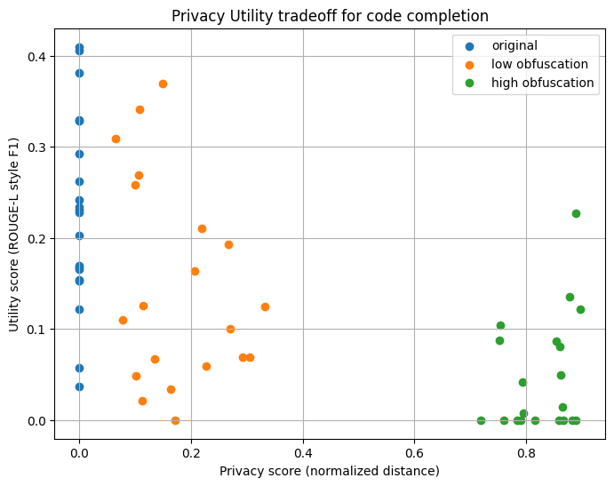

# Privacy–Utility Trade-off in LLM Code Completion

If you hide sensitive parts of your code before sending it to a code-completion model, how much worse do the completions get? This project measures that trade-off on 20 HumanEval tasks with CodeT5.



## Setup

- **Data:** the first 20 tasks of HumanEval (`openai/openai_humaneval`, test split), loaded with Hugging Face `datasets`
- **Model:** `Salesforce/codet5-small`, loaded with Hugging Face `transformers`. Beam search with 4 beams, up to 128 new tokens, prompts truncated to 512 tokens
- **Prompt versions:** every task prompt is sent in three versions, giving 60 completions in total
  - **Original:** unchanged
  - **Low obfuscation:** names defined in the prompt (functions, parameters, variables longer than two characters) are renamed to `v0`, `v1`, ... using Python's `tokenize` module. Keywords, built-ins and imported names (e.g. `List`) are kept. The same names are also replaced where they appear inside docstrings and comments, but ordinary English words stay readable
  - **High obfuscation:** low obfuscation, plus comments removed, every string (docstrings included) replaced with `"STR"`, and extra blank lines merged

## Metrics

- **Privacy:** normalized Levenshtein distance between the obfuscated prompt and the original prompt (0 = unchanged, 1 = completely different)
- **Utility:** character-level ROUGE-L style F1, based on the longest common subsequence between the generated completion and the canonical solution

## Results

Average scores across the 20 tasks (current version):

| Prompt version   | Privacy | Utility |
| ---------------- | ------- | ------- |
| Original         | 0.000   | 0.228   |
| Low obfuscation  | 0.176   | 0.147   |
| High obfuscation | 0.828   | 0.048   |

Renaming identifiers alone costs about a third of the utility (0.228 to 0.147). Removing comments and masking strings on top of that cuts utility by about 80% compared with the original prompts (0.228 to 0.048). Most of what the model uses seems to sit in the natural-language docstring, not in the names.

## Version history

The first version renamed identifiers with a regular expression. That regex also rewrote ordinary words inside the docstrings, so "low" obfuscation removed most of the task description, not only the names. Version 2 renames only real code identifiers using Python's `tokenize` module.

| Version              | Low: privacy / utility | High: privacy / utility |
| -------------------- | ---------------------- | ----------------------- |
| v1 (regex renaming)  | 0.531 / 0.078          | 0.889 / 0.008           |
| v2 (tokenize, current) | 0.176 / 0.147        | 0.828 / 0.048           |

Original prompts score 0.000 / 0.228 in both versions. With the docstrings left readable, low-obfuscation utility nearly doubled, which shows how much the v1 numbers were driven by the regex side effect rather than by hiding the names.

## Limitations and what I would change

- **Weak baseline.** codet5-small is a small model that is not instruction-tuned. Even with the original prompts, utility is only 0.228, and some completions repeat parts of the prompt instead of solving the task. The differences between versions are measured against a low ceiling.
- **Utility measures similarity, not correctness.** Character-level F1 rewards text that looks like the reference solution. Running the HumanEval unit tests (pass@1) would be the stronger measure.
- **Privacy measures change, not leakage.** Edit distance shows how much the prompt text changed, not how much sensitive information a model could still recover from it. Low obfuscation scores only 0.176 partly because the docstring text, which makes up most of each prompt, is now kept.
- **Small sample.** 20 tasks, one model and one run, so the numbers are indicative rather than conclusive.

## Repository contents

- `Privacy_Preserving_Techniques_for_LLM_Code_Completion.ipynb`: the full pipeline, covering data loading, obfuscation functions, completion generation, scoring, the plot and the analysis
- `privacy_utility.png`: the plot shown above

## How to run

```bash
pip install datasets "transformers<5" torch python-Levenshtein matplotlib evaluate
```

Open the notebook and run all cells. The model and the dataset are downloaded from the Hugging Face Hub on the first run. No GPU is needed.

## Tech

Python · Hugging Face Transformers and Datasets · PyTorch (as the model backend) · python-Levenshtein · Matplotlib · Jupyter
